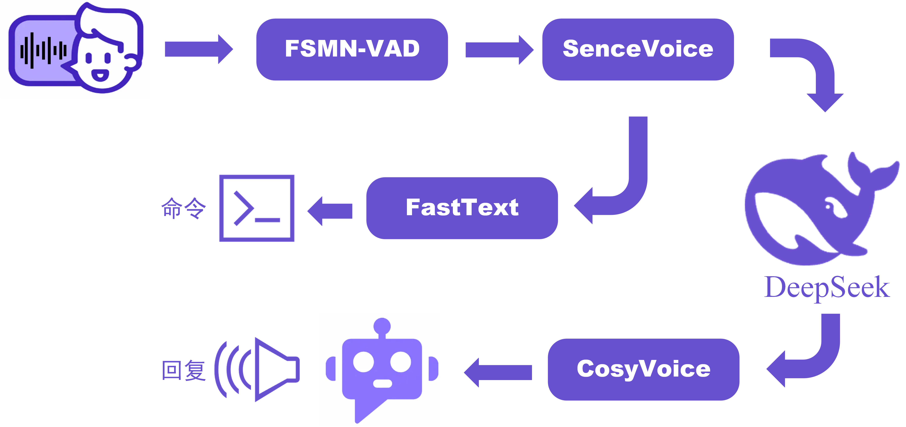
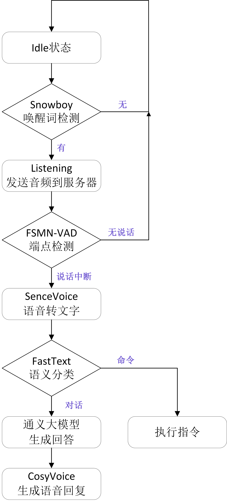

<h1 align="center">Demos for Echo</h2>

这个仓库存放着Echo开发板的各种例程, 包括LVGL, AI对话机器人, 机器视觉等独立的demo。

Echo-Mate桌面助手机器人[DeskBot_demo](./DeskBot_demo/README.md)就是把他们融合起来做成的, LVGL作为UI界面, 这些高级demo作为子APP～

<h2 align="center">1. AI语音助手 demo (独立)</h2>

### :ledger: Overview

这个AI语音助手的项目可以完美部署到轻量级的Linux开发板上~本项目的AI语音助手的大致结构框图如下, 分为Client端和Server端，Client端运行在开发板上，Server可以在电脑上跑，然后开发板连接上即可。

<p align="center">
	
</p>

[FSMN-VAD](https://www.modelscope.cn/models/iic/speech_fsmn_vad_zh-cn-16k-common-pytorch/summary): 阿里达摩院语音端点检测模型，用于检测语音活跃端点

<p align="center">
	
</p>

[SenceVoice](https://github.com/FunAudioLLM/SenseVoice): 阿里的音频处理模型，用于语音转文字(ASR)，情感识别(SER)等

<p align="center">
	
</p>

[CosyVoice](https://github.com/FunAudioLLM/CosyVoice):  语音生成大模型，用于文字转语音生成(TTS)

<p align="center">
	
</p>

[FastText](https://fasttext.cc/): Facebook于2016年开源的一个词向量计算和文本分类工具，这里用于获取说话人的指令进行一个多分类任务

### :file_folder:运行流程：

本项目的服务器Sever端，可以在没有GPU的笔记本电脑运行，除了通义千问和CosyVoice这两个生成式模型是调用阿里的API，其他的都是运行在本地的，当然如果有较强算力的同学，可以直接将这些模型都部署到本地服务器~

**注意：** 如果需要自定义指令识别，可以重新改一下fastText的数据集，然后再训练得到自己的模型即可拿去用了，详见Sever端的文件夹中的内容。

AI语音助手的运行流程大致如下图所示：

<p align="center">
	
</p>

### :bookmark_tabs:Websockets协议定义：

Client端和Server端通过Webscokets进行通信，通过JSON进行交互，语音传输格式为opus. 

具体内容详见[Client](./AIChat_demo/Client/README.md)和[Server](./AIChat_demo/Server/README.md)的README.


<h2 align="center">2. yolov5 demo (独立)</h2>

to be write

<h2 align="center">Echo-Mate 桌面AI助手</h2>

### :ledger: Overview

详见DeskBot_demo文件夹，这个文件夹包含了LVGL和其他demo的内容, 相当于是多个分离demo的融合，组成了Echo-Mate桌面AI助手, 详细如何编译使用见[DsekBot_demo](./DeskBot_demo/README.md).

### :bookmark_tabs:Websockets整体框架：

项目的文件目录如下:

```
Server/
├── bin/					# 可执行文件
├── build/					# build缓存
├── common/					# build缓存
│   ├── sys_manager/		# 开发板硬件对应的管理
│   └── xxx_manager/  		# xxx对应的管理
├── conf/					# 系统设置
├── gui_app/				# UI层的软件
│   ├── common/				# UI层扩展lib
│   ├── font/				# UI字体
│   ├── images/				# UI图片
│   ├── pages/  			# UI层主要pages
│   └── ui.c/h  			# 
├── lvgl/					# lvgl核心组件
├── utils     				# 其他
├── lv_conf.h     			# lvgl设置
└── main.c
```

对于用C++写的AIChat, 转换为了C接口, 以方便在LVGL项目的UI层中访问, 细节详见[AIChat_demo](./AIChat_demo/)