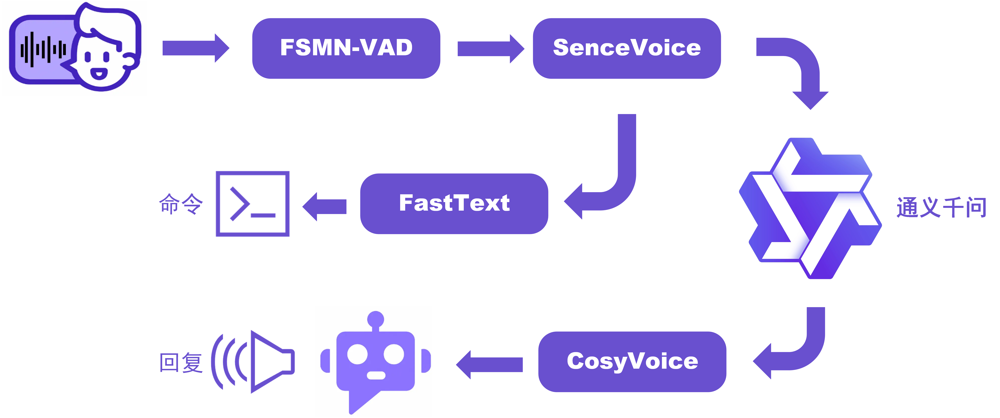

<h1 align="center">Echo-Mate Demos</h1>

<h2 align="center">AI语音助手DEMO</h2>

### :ledger: Overview

这个AI语音助手的项目可以完美部署到轻量级的Linux开发板上~本项目的AI语音助手的大致结构框图如下：

	

FSMN-VAD: 阿里达摩院语音端点检测模型，用于检测语音活跃端点

	

SenceVoice: 阿里的音频处理模型，用于语音转文字(ASR)，情感识别(SER)等

	

CosyVoice:  语音生成大模型，用于文字转语音生成(TTS)

	

FastText: FaceBook的

本项目的服务器Sever端，可以在没有GPU的笔记本电脑运行，除了通义千问和CosyVoice这两个生成式模型是调用阿里的API，其他的都是运行在本地的，当然如果有较强算力的同学，可以直接将这些模型都部署到本地服务器~

### :file_folder:运行流程：

1

### :bookmark_tabs:Websockets协议定义：

Client端和Server端通过Webscokets进行通信，

<h2 align="center">yolov5 demo</h2>

todo

